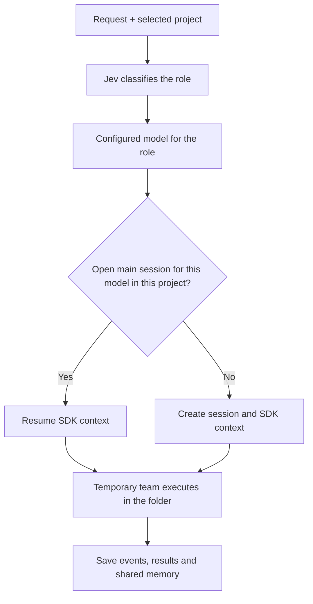

# Claudex

**Describe what you need. Jev chooses a model. A coordinated team works directly in your local folder.**

Claudex is an Electron desktop app using the official Claude Code and Codex SDKs, routed by Jev / TypeSafe. Add any existing folder, connect your accounts, and submit a request. Git is not required for project folders.

The interface has a request field at the top, projects on the left, session tabs and a live activity panel. Changes are written directly to the selected folder. There are no missions, scheduled tasks, worktrees, branches or Apply steps.

[Leia em português](README.pt-BR.md)

## Models and routing

### Per-agent effort

In **Contas e ajustes → Modelos dos agentes**, set **Esforço Simple**, **Esforço Complex** and **Esforço Planner** independently. **Padrão do modelo** leaves effort unspecified in the SDK call. Claude offers `low`, `medium`, `high`, `xhigh` and `max`; Codex offers levels accepted by the installed SDK: `minimal`, `low`, `medium`, `high`, `xhigh`, `max`, `ultra` and `persistent`. Actual support depends on the model; a provider's list does not guarantee that every model supports every level.

Settings persist and apply to subsequent requests and collaborators routed to that role. Changing only effort preserves the session and its context. Each session records the effort used in its latest run, displays it in the header, and uses it for compaction. An already running execution retains its initial effort. Higher effort may increase response time and token usage. See the [Claude effort reference](https://platform.claude.com/docs/en/build-with-claude/effort) and [Codex SDK reference](https://developers.openai.com/codex/sdk).

Environment settings are `DEFAULT_SIMPLE_EFFORT`, `DEFAULT_COMPLEX_EFFORT` and `DEFAULT_PLANNER_EFFORT`. Leave them empty to use the default. For example: `DEFAULT_SIMPLE_EFFORT=low`, `DEFAULT_COMPLEX_EFFORT=high` and `DEFAULT_PLANNER_EFFORT=max`. The UI updates available options when switching providers and returns to the default if the previous effort is incompatible with the new provider.

### Roles and models

Jev classifies each request and selects a role. The model configured for that role coordinates the work and can request collaborators when needed.

| Role                            | Default model       | Configuration           |
| ------------------------------- | ------------------- | ----------------------- |
| Simple changes                  | Claude Sonnet       | `DEFAULT_SIMPLE_MODEL`  |
| Implementation and integrations | Codex (`gpt-6-sol`) | `DEFAULT_COMPLEX_MODEL` |
| Architecture and investigation  | Claude Opus         | `DEFAULT_PLANNER_MODEL` |

In **Contas e ajustes → Modelos dos agentes**, select a provider and model identifier for each role. These choices also apply to collaborators. Exact Claude model identifiers are supported; the selected model must be available to your account. Settings persist and apply to subsequent calls. Environment values can include the provider, such as `claude:sonnet`, `claude:opus` or `codex:gpt-6-sol`; existing unqualified defaults remain supported.

Without a Jev key, or if the API request fails, the local heuristic chooses based on the current request and the interface identifies the fallback. Connect the providers selected for your roles.

To select Claude Opus 5.5 specifically, choose **Claude** and enter `claude-opus-5-5` in the model field. In environment configuration, use `claude:claude-opus-5-5`. [Anthropic documents this full identifier](https://support.claude.com/en/articles/11940350-claude-code-model-configuration); `opus-5.5` is not that identifier. The `opus` alias lets the provider choose the version.

Sonnet 5.5 is also available in the suggestions: choose **Claude** and use `claude-sonnet-5-5`, as listed in the [official documentation](https://platform.claude.com/docs/en/models/sonnet-5-5/overview). In environment configuration, use `claude:claude-sonnet-5-5`. The `sonnet` alias lets the provider choose the version.

## Sessions, context and panel sizes

Tabs display **Planner**, **Simple** or **Complex**, followed by the chosen model; collaborators are identified in the name. **×** closes a session and removes its tab while preserving project files, stored history and shared memory. Closing an active session stops its team first. Closed sessions are not resumed; if no other open main session exists for that model in the project, the next request creates one.

The header displays context occupancy and its limit when available. Structured SDK data takes priority; other values are explicitly estimates. Claude uses the last input when available, while Codex estimates from known text without access to all internal context or automatic compactions. This is not cumulative token consumption. Exact model IDs can use documented limits as a fallback; aliases and unknown models show an unknown limit until the SDK supplies it.

**Compactar contexto** asks the session's model for a continuity summary. After success, the next call starts a new internal provider conversation with that summary, retaining the same tab and shared memory. Displayed history is kept. Failures preserve the previous context. Compaction makes a model call and consumes the connected account's quota or paid usage.

Drag the splitter below the request to resize input/chat height. The splitter between projects and chat adjusts their widths on larger screens. Sizes persist locally; double-click a splitter to reset it, or use keyboard arrows to adjust. The request field has no focus border while typing.

Messages use the available chat width with internal padding. Dark is the default theme; an existing saved theme preference takes precedence.

## Request flow and session reuse



Jev receives the request and recent project memory. Categories `fast` and `balanced` select **Simple**, `strong` selects **Complex**, and `judgment` selects **Planner**. The role selects a configured provider/model rather than searching arbitrary models. Planner can execute and edit files too; its name does not enforce read-only behavior.

Main session reuse matches **project + provider:model + open session**, excluding collaborator sessions. The role label is not part of that key: if Simple and Planner both use `claude:sonnet`, they can resume the same session, and the tab displays the current call's role. Different models or projects do not share SDK conversation identifiers.

Selecting a tab displays its history; **it does not force the next request to use that model**. Every submission is routed again. Changing a configured model preserves project memory and can resume an existing open session for the newly selected model.

## Photos and files in requests

Click **Anexar** to choose photos or files, paste images into the request field with **Ctrl+V**, or drag files onto the request panel. Images have previews; each attachment's **×** removes it before sending. **Enter** sends text and attachments together; **Shift+Enter** inserts a new line. Attachment-only requests are supported and use “Analise os anexos enviados” as their request. Failed submissions keep the draft attachments.

Limits: **8 attachments per request**, **8 MB per file**, and **20 MB total**. PNG, JPEG, GIF and WebP are sent as native image inputs to the Claude and Codex SDKs. SVG and other files are available as path references; reading specific formats depends on the agent's tools.

Copies are stored under `attachments/<project-id>/` in application data with generated internal names. Attaching files does not copy them into the working project folder. Agents are instructed to treat them as read-only references; collaborators receive their paths, and shared records retain the references. Request history displays attachments and lets you open them. `sessions.json` stores metadata and paths, not binary contents; include `attachments/` when backing up attachments.

## Project terminal

The **Terminal** tab on the right of the agent tabs opens PowerShell on Windows or Bash on other systems, starting in the selected project's folder. Enter a command and press Enter or **Executar**. Output streams live, and Up/Down arrows recall entered commands.

Each project has its own shell, retaining variables, directory changes and processes when switching tabs. **Limpar** clears displayed output; **Encerrar** stops the shell and its processes. **Abrir terminal** starts a new shell in the original project folder. Closing the app stops terminals. Output and command history stay in memory. Commands run with your user's permissions, and their file changes are detected by the next agent inventory.

This panel provides text input/output without PTY emulation. Ordinary commands and local servers can run here; full-screen interactive programs require an external terminal.

## Automatic collaboration

**The main agent decides when to split work.** A `delegate` call routes the subtask to its role and configured model. It returns without waiting for completion, allowing independent parts to start concurrently. Delegation is not mandatory for every request and depends on the model using the available tools.

| Tool           | Purpose                                                                                          |
| -------------- | ------------------------------------------------------------------------------------------------ |
| `delegate`     | Start a collaborator with write scopes or read-only mode.                                        |
| `read_team`    | Read memory, members, states, results and recent messages; search or page through older records. |
| `message_team` | Publish decisions and changes to the team or a recipient.                                        |
| `wait_agents`  | Wait for the caller's descendants and inspect their states and results.                          |

The team is temporary, while collaborator sessions remain stored. A previous collaborator can be resumed when **provider/model, write scopes and read-only mode** match, provided it is open, inactive and outside the current team. Main sessions and collaborator sessions are reused separately.

One coordinated team may edit a folder or its subfolders at a time. The selected agent can automatically delegate independent work; collaborators may delegate smaller parts too. Teams support up to four active agents, eight delegations per request and two collaborator levels. Common MCP tools let Claude and Codex read shared context, exchange messages, start collaborators and gather results. Overlapping collaborator write scopes are rejected. Scope reservations coordinate agents through instructions; they are not a filesystem security boundary. Independent folders can run concurrently. Stopping a member stops its entire team and keeps already edited files. Removing a project removes its registration, not its files. The activity panel displays public SDK messages, tool operations and results without repeating identical final answers.

## Persistent sessions and shared memory

**Sending another request does not automatically create a new session.** Jev selects the role, and Claudex uses its configured model. An open main session for that model in the project is resumed; otherwise one is created. Provider conversations can resume after restarting the app. Different models and projects maintain separate conversations. Changing models preserves shared project memory.

All models receive recent shared project history: previous requests, results, communicated decisions and changed file paths. Older records remain stored and can be searched or retrieved through team tools. A filesystem inventory detects external and manual edits without Git. It supplies paths and metadata, not file contents. Agents must inspect current files before editing.

Context has three distinct layers:

| Layer            | Contents                                                        | How the agent receives it                               |
| ---------------- | --------------------------------------------------------------- | ------------------------------------------------------- |
| Own conversation | Claude or Codex internal context, separate for each session.    | SDK conversation identifier used for resumption.        |
| Project memory   | Requests, summarized results, communications and changed paths. | Recent records at call startup and `read_team` queries. |
| Current files    | Actual contents of the selected folder.                         | Agent tools reading the files.                          |

Initial memory includes up to approximately **24,000 characters** of recent records, not the full history of every conversation. The initial team context is a snapshot; agents must call `read_team` for updates during execution. Messages are available for consultation, but **are not automatically injected into another running model's context**. The team board returns the latest 20 messages; communications and results also feed persistent project memory. Summaries do not replace reading current files.

The inventory skips dependencies, artifacts and symbolic links, stops after 10,000 entries, and uses size/time for files larger than 2 MB. Partial inventories are identified. Shared memory and provider contexts survive restarts.

Agent responses render Markdown headings, emphasis, lists, links, tables, quotes and code blocks with a **Copy** button. Content is sanitized before display. Terminal and tool output render basic ANSI colors and discard control sequences so escape codes do not appear as text.

## Run

Node.js 22+ is required. Run these commands in the Claudex source folder:

```bash
npm install
npm run build
npm run app
```

1. Click **+** in the project list and select a folder on your computer.
2. Connect Claude/Codex in **Contas e ajustes**. Configure a Jev key to enable API routing.
3. Write your request and press **Enter**, or click **Enviar pedido**. **Shift+Enter** inserts a new line.
4. Follow agent messages, tools and results in the session tabs.

Or use `npm run app:web` and open [http://127.0.0.1:8080](http://127.0.0.1:8080). Desktop mode has a native folder picker; web mode provides local folder navigation.

## Accounts and configuration

Connect Claude/Codex in **Contas e ajustes**, or enter API keys. API keys take precedence over subscription login and may incur usage charges. Jev configuration is optional. Settings entered in the UI are saved in the app data directory, including for packaged installations. HTTP and WebSocket requests validate local host and origin.

On Windows, the default application data directory is `%APPDATA%\Claudex`; `CLAUDEX_DATA_DIR` overrides it. At startup, existing process environment variables take precedence, followed by the application data `.env`, then the source folder `.env`. Provider login credentials stay in files managed by their SDKs.

See [.env.example](.env.example) for optional configuration:

| Variable                               | Purpose / default                           |
| -------------------------------------- | ------------------------------------------- |
| `TYPESAFE_API_KEY`                     | Jev API key                                 |
| `TYPESAFE_BASE_URL`                    | Jev endpoint; `https://api.typesafe.ai`     |
| `JEV_MODEL`                            | Routing model; `jev-latest`                 |
| `JEV_CACHE_TTL`                        | Routing cache lifetime in seconds; `3600`   |
| `ANTHROPIC_API_KEY` / `OPENAI_API_KEY` | Optional provider API keys                  |
| `DEFAULT_*_MODEL`                      | Models for the roles listed above           |
| `WS_PORT`                              | Local server port; `8080`                   |
| `AGENT_TIMEOUT_MS`                     | Execution timeout in milliseconds; `600000` |

### When Jev uses the local router

Activity reports the reason, such as a missing key, authentication refusal, rate limit, certificate failure, connection failure or invalid response. A fallback does not by itself mean the key is invalid.

Desktop mode uses Electron networking and system trust settings. Node mode includes system certificate authorities when the installed runtime supports that API. HTTPS certificate verification remains enabled. After updating the source, run `npm run build` and restart the app to load the networking fix.

## Stored data

In the Windows desktop app, the main file is **`%APPDATA%\Claudex\sessions.json`**. It stores application session state, not a complete copy of each SDK's internal history or a backup of edited files.

| Location in the data directory | Contents                                                                                                                                                                    |
| ------------------------------ | --------------------------------------------------------------------------------------------------------------------------------------------------------------------------- |
| `sessions.json`                | Projects, main and collaborator sessions, events, memory, inventory, SDK identifiers, compaction summaries and context indicators. Closed sessions remain marked as closed. |
| `.env`                         | Settings saved through the UI, including models and the Jev key.                                                                                                            |
| `logs/`                        | Application logs.                                                                                                                                                           |
| `Local Storage/`               | Desktop UI preferences such as theme, selected project and panel sizes.                                                                                                     |
| `projects.json`                | Legacy project registrations, imported when needed.                                                                                                                         |

Active teams, scope reservations and the message board exist during execution. Communications are also recorded in project memory. Provider SDKs manage internal conversation history; Claudex stores identifiers to resume it. To back up application history, close the app and copy `sessions.json`; copying the entire data directory includes `.env` credentials. Back up work files separately from each project's folder.

Projects, activity, shared memory and provider session identifiers are stored in `sessions.json` in the application data directory. Legacy folder registrations are imported from `projects.json`; old data is preserved without restarting previous runs or schedules. Unfinished runs are marked interrupted after restart and are not automatically executed again. Each model session keeps up to 500 visible activity events; this display limit does not reset the provider context or discard shared memory.

## Validate

```bash
npm run typecheck
npm run lint
npm test -- --maxWorkers=2 --minWorkers=1
npm run build
npm run ui:check
```

The UI check uses installed Chrome, real local storage/HTTP/WebSocket, and simulated agents. It verifies single-response display, model selection, collaborators, direct editing of a folder without Git, persistent model contexts, reused tabs, drafts, cancellation, errors, escaping, themes and responsive layouts. An actual MCP client checks delegation, messaging and authentication against the stdio bridge. These checks make no paid model calls. Reports and screenshots are written to `.claudex/qa/direct/`.

## Windows installer and icon

`npm run dist` builds the NSIS installer in `release/`. The window has no native menu bar (File, Edit, View…) on Windows and Linux; macOS keeps the system menu so Copy/Paste continue to work.

- **Icon:** `build/icon.png` and `build/icon.ico` (16–256 px) are generated without dependencies by `node scripts/make-icon.mjs`. `signAndEditExecutable` is enabled so the icon is embedded in `Claudex.exe`, which is what the desktop shortcut and taskbar use. After installing, Windows may keep showing the old icon until the icon cache is refreshed or Explorer is restarted.
- **winCodeSign:** embedding the icon needs the `winCodeSign` tool. On Windows without Developer Mode its download fails on symbolic links. Extract the archive manually, skipping the `darwin` and `linux` folders, into `<cache>/winCodeSign/winCodeSign-2.6.0` and point `ELECTRON_BUILDER_CACHE` to that `<cache>` when building. This repository keeps it in `.claudex/qa/builder-cache`.
- **Packaged binaries:** the Claude and Codex executables cannot run from inside `app.asar`. They are unpacked by `asarUnpack`, and `src/agents/claude.ts` and `src/agents/codex.ts` point to the `app.asar.unpacked` copy when the app is packaged.
- **Build output:** if a previous build is still open, electron-builder cannot overwrite `release/win-unpacked`. Close the app or use `--config.directories.output=release/<other-folder>`.

## Architecture and contributing

- `src/application/sessionService.ts`: project sessions, routing and execution lifecycle.
- `src/application/agentTeam.ts`: coordinated delegation, messages and team limits.
- `src/application/projectMemory.ts`: shared history and filesystem inventories.
- `src/application/terminalService.ts`: persistent project shells and process cleanup.
- `src/agents/`: Claude/Codex adapters and the MCP team bridge.
- `src/jev.ts` and `src/jevTransport.ts`: routing, fallback reasons and HTTPS transport.
- `src/server/`, `src/chat/` and `desktop/`: local server, interface and Electron shell.

See [simplification design](SPEC-simplification.md), [collaboration design](SPEC-collaboration.md), [contributing](CONTRIBUTING.md), [security](SECURITY.md) and [changelog](CHANGELOG.md). Use `npm run dist` to build distribution artifacts.

This source change does not update previously installed releases. A new distribution is required to ship it.

[Documentação em português](README.pt-BR.md) · [MIT license](LICENSE)
