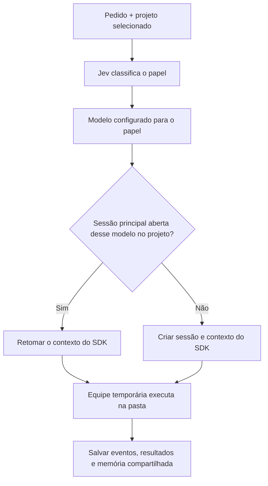

# Claudex

**Escreva o que você precisa. Jev escolhe o modelo. Uma equipe coordenada trabalha diretamente na sua pasta.**

O Claudex é um aplicativo desktop local em Electron que combina o roteador Jev / TypeSafe com os SDKs oficiais de Claude Code e Codex. Qualquer pasta existente pode ser um projeto. Não é necessário Git.

A interface reúne o campo de pedido no topo, os projetos à esquerda e as sessões dos agentes com atividade ao vivo no centro.

[Read in English](../README.md)

## Como usar

1. Clique em **+** na lista de projetos e escolha uma pasta do computador.
2. Conecte Claude/Codex em **Contas e ajustes**. A chave Jev é opcional.
3. Escreva seu pedido no campo superior e pressione **Enter** ou clique em **Enviar pedido**. **Shift+Enter** insere uma nova linha.
4. Acompanhe respostas, ferramentas e resultado na aba da sessão.

**Enviar outro pedido não cria automaticamente uma nova sessão.** Jev escolhe o papel a cada pedido, e o Claudex usa o modelo configurado para esse papel. Uma sessão principal aberta desse modelo no projeto é retomada; se não houver, uma nova é criada. Modelos diferentes mantêm contextos próprios, preservados também após reabrir o aplicativo; projetos diferentes não compartilham sessões. As alterações são gravadas diretamente na pasta: não existem missões, tarefas, agendamentos, worktrees, branches, revisões ou botão Aplicar.

**Parar agente** interrompe a equipe inteira; arquivos já alterados permanecem na pasta. Uma pasta e seus subdiretórios recebem uma equipe coordenada por vez. Dentro dela, os agentes podem trabalhar simultaneamente. Projetos em pastas independentes podem executar em paralelo. Remover um projeto da lista não apaga seus arquivos.

## Sessões, contexto e tamanho dos painéis

As abas usam **Planner**, **Simple** ou **Complex**, seguidos do modelo escolhido; colaboradores são identificados no nome. O **×** fecha a sessão e a retira das abas, preservando os arquivos, o histórico armazenado e a memória compartilhada do projeto. Fechar uma sessão ativa interrompe sua equipe antes de fechá-la. A sessão fechada não é retomada; se não existir outra sessão principal aberta daquele modelo no projeto, o próximo pedido cria uma nova.

O cabeçalho mostra a ocupação do contexto e o limite quando disponível. Dados estruturados do SDK têm prioridade; os demais valores são marcados como estimativas. Claude usa a última entrada quando disponível; Codex estima pelos textos conhecidos, sem acesso a todo o contexto interno ou às compactações automáticas. O indicador não representa o consumo acumulado de tokens. Limites de modelos específicos usam a documentação oficial como fallback; aliases e modelos desconhecidos ficam com limite não informado até o SDK fornecê-lo.

**Compactar contexto** pede ao modelo da sessão um resumo de continuidade. Após concluir, a próxima chamada começa com esse resumo em uma nova conversa interna do provedor, mantendo a mesma aba e a memória compartilhada. O histórico exibido não é apagado. Falhas preservam o contexto anterior. A compactação faz uma chamada ao modelo e usa a cota ou cobrança da conta conectada.

Arraste a divisória abaixo do pedido para ajustar a altura do input e do chat. A divisória entre projetos e chat ajusta a largura dos dois painéis em telas maiores. Os tamanhos ficam salvos; duplo clique na divisória restaura o padrão, e as setas do teclado também permitem ajustar. O campo de pedido não exibe borda de foco enquanto você escreve.

As mensagens ocupam a largura disponível do chat, respeitando o espaçamento interno. O tema padrão é escuro; uma escolha de tema já salva tem prioridade.

## Caminho do pedido e reutilização de sessões



Jev recebe o pedido e a memória recente do projeto. As categorias `fast` e `balanced` usam **Simple**, `strong` usa **Complex** e `judgment` usa **Planner**. O papel define qual configuração consultar, não uma busca livre por modelos. Planner também pode executar e editar arquivos; o nome não impõe somente leitura.

A reutilização principal compara **projeto + provedor:modelo + sessão aberta**, excluindo sessões de colaboradores. O rótulo do papel não faz parte dessa chave: se Simple e Planner estiverem configurados com o mesmo `claude:sonnet`, podem retomar a mesma sessão, e a aba passa a mostrar o papel da chamada atual. Sessões de modelos ou projetos diferentes não recebem o mesmo identificador do SDK.

Selecionar uma aba serve para acompanhar seu histórico; **não força o próximo pedido para aquele modelo**. Todo envio é roteado novamente. Trocar o modelo nos ajustes preserva a memória do projeto e pode retomar uma sessão aberta que já exista para o novo modelo.

## Fotos e arquivos no pedido

Clique em **Anexar** para escolher fotos ou arquivos, cole imagens no campo com **Ctrl+V**, ou arraste arquivos para o bloco do pedido. As imagens têm prévia; o **×** de cada anexo remove-o antes do envio. **Enter** envia texto e anexos juntos; **Shift+Enter** continua inserindo uma nova linha. É possível enviar apenas anexos: nesse caso, o pedido é “Analise os anexos enviados”. Falhas de envio mantêm os anexos no rascunho.

Limites: **8 anexos por pedido**, **8 MB por arquivo** e **20 MB no total**. PNG, JPEG, GIF e WebP são enviados como imagens nativas aos SDKs de Claude e Codex. SVG e outros arquivos ficam disponíveis como referências por caminho; a leitura de formatos específicos depende das ferramentas do agente.

As cópias ficam em `attachments/<id-do-projeto>/` na pasta de dados do aplicativo, com nomes internos gerados pelo Claudex. Anexar não copia arquivos para a pasta de trabalho do projeto. Os agentes são instruídos a usar essas referências em somente leitura; os colaboradores recebem seus caminhos, e os registros compartilhados preservam as referências. O histórico do pedido mostra os anexos e permite abri-los. `sessions.json` guarda metadados e caminhos, não o conteúdo binário; para fazer backup dos anexos, copie também `attachments/`.

## Terminal do projeto

A aba **Terminal**, à direita das abas dos agentes, abre um PowerShell no Windows ou Bash nos demais sistemas, na pasta do projeto selecionado. Digite um comando e pressione Enter ou **Executar**. A saída aparece ao vivo; as setas para cima/baixo recuperam os comandos digitados.

A sessão mantém variáveis, mudanças de diretório e processos enquanto você troca de aba. Cada projeto tem sua própria sessão. **Limpar** apaga a saída exibida; **Encerrar** termina o shell e seus processos, e **Abrir terminal** inicia outra sessão na pasta original do projeto. Fechar o aplicativo encerra os terminais. A saída e o histórico de comandos ficam apenas em memória. Os comandos usam as permissões do seu usuário; alterações feitas por eles entram no inventário da próxima chamada dos agentes.

Este painel usa entrada e saída de texto, sem emulação de PTY. Comandos comuns e servidores locais podem ser executados; programas que exigem um terminal interativo de tela inteira precisam de um terminal externo.

## Colaboração automática

Você escreve o pedido; o agente escolhido coordena o trabalho e chama colaboradores quando existem partes independentes. Os colaboradores também podem delegar partes menores. Jev escolhe o modelo de cada chamada. As abas identificam os colaboradores, e os agentes podem trocar mensagens, consultar o estado da equipe e reunir os resultados antes de responder.

**Quem decide dividir o trabalho é o agente principal.** Ao chamar `delegate`, a subtarefa passa pelo roteamento para escolher seu papel e modelo. A ferramenta retorna sem esperar a conclusão, permitindo iniciar partes independentes em paralelo. Não há divisão obrigatória de todo pedido: a delegação depende de o modelo usar as ferramentas fornecidas.

| Ferramenta     | Função                                                                                                     |
| -------------- | ---------------------------------------------------------------------------------------------------------- |
| `delegate`     | Iniciar um colaborador com áreas de edição ou modo de somente leitura.                                     |
| `read_team`    | Consultar memória, membros, estados, resultados e mensagens recentes; buscar ou paginar registros antigos. |
| `message_team` | Publicar decisões e mudanças para a equipe ou um destinatário.                                             |
| `wait_agents`  | Esperar os próprios descendentes e consultar seus estados e resultados.                                    |

A equipe é temporária, mas as sessões de seus colaboradores ficam salvas. Um colaborador anterior pode ser retomado quando coincidem **provedor/modelo, áreas de edição e modo de leitura**, desde que esteja aberto, inativo e fora da equipe atual. Sessões principais e sessões de colaboradores são reutilizadas separadamente.

Todos recebem um registro compartilhado do projeto com pedidos anteriores, resultados, decisões comunicadas e caminhos alterados. Um inventário de arquivos detecta também mudanças feitas manualmente desde a última execução, sem Git. A memória fica nos dados do aplicativo e continua disponível após reiniciar. Cada chamada recebe os registros recentes; os agentes podem pesquisar e recuperar os registros anteriores pelas ferramentas da equipe, sem descartá-los por causa do limite de contexto. Cada agente precisa ler os arquivos atuais antes de editar. O inventário é limitado a 10.000 entradas; dependências, artefatos e links simbólicos não são percorridos. Arquivos acima de 2 MB usam tamanho/data em vez de hash de conteúdo. A interface informa inventários parciais.

O inventário fornece caminhos e metadados, não o conteúdo dos arquivos. O histórico compartilhado complementa a conversa própria de cada modelo.

Há três camadas distintas de contexto:

| Camada             | O que contém                                                      | Como chega ao agente                                                 |
| ------------------ | ----------------------------------------------------------------- | -------------------------------------------------------------------- |
| Conversa própria   | Contexto interno do Claude ou Codex, separado por sessão.         | Retomada pelo identificador do SDK.                                  |
| Memória do projeto | Pedidos, resultados resumidos, comunicações e caminhos alterados. | Registros recentes no início da chamada e consultas por `read_team`. |
| Arquivos atuais    | O conteúdo real da pasta escolhida.                               | Leitura dos arquivos pelas ferramentas do agente.                    |

A memória inicial inclui até cerca de **24.000 caracteres** de registros recentes, não todo o histórico de todas as conversas. Durante a execução, o contexto inicial é uma fotografia: os agentes precisam consultar `read_team` para obter novidades. As mensagens ficam disponíveis para consulta, mas **não são injetadas automaticamente no contexto de outro modelo em execução**. O quadro da equipe retorna as últimas 20 mensagens; comunicações e resultados também alimentam a memória persistente. Resumos não substituem a leitura dos arquivos atuais.

| Limite da equipe                        | Valor |
| --------------------------------------- | ----- |
| Agentes ativos, incluindo o coordenador | 4     |
| Tentativas de delegação por pedido      | 8     |
| Níveis de colaboradores                 | 2     |

Áreas de edição sobrepostas entre colaboradores são recusadas. As reservas coordenam o trabalho e são incluídas nas instruções dos agentes; não oferecem isolamento de segurança por arquivo. Análises podem compartilhar leitura. O coordenador reúne os resultados antes de concluir, e falhas dos colaboradores são propagadas para a execução coordenadora. A resposta final não repete a mesma mensagem enviada pelo SDK.

## Modelos e roteamento

### Esforço de cada agente

Em **Contas e ajustes → Modelos dos agentes**, defina **Esforço Simple**, **Esforço Complex** e **Esforço Planner** de forma independente. **Padrão do modelo** não envia um esforço explícito ao SDK. Claude oferece `low`, `medium`, `high`, `xhigh` e `max`; Codex oferece os níveis aceitos pelo SDK instalado: `minimal`, `low`, `medium`, `high`, `xhigh`, `max`, `ultra` e `persistent`. A disponibilidade efetiva depende do modelo; a lista do provedor não garante suporte de todos os modelos a todos os níveis.

Os ajustes ficam salvos e valem para os próximos pedidos e colaboradores roteados para aquele papel. Mudar somente o esforço mantém a sessão e seu contexto. Cada sessão registra o esforço da última execução, exibido no cabeçalho; a compactação usa esse valor. Uma execução já iniciada continua com o esforço com que começou. Mais esforço pode aumentar o tempo de resposta e o uso de tokens. Consulte as referências de [Claude](https://platform.claude.com/docs/en/build-with-claude/effort) e [Codex](https://developers.openai.com/codex/sdk).

Pelo ambiente, use `DEFAULT_SIMPLE_EFFORT`, `DEFAULT_COMPLEX_EFFORT` e `DEFAULT_PLANNER_EFFORT`. Deixe vazio para usar o padrão. Exemplo: `DEFAULT_SIMPLE_EFFORT=low`, `DEFAULT_COMPLEX_EFFORT=high` e `DEFAULT_PLANNER_EFFORT=max`. A interface atualiza as opções ao trocar o provedor e volta ao padrão se o esforço anterior não for aceito pelo novo provedor.

### Papéis e modelos

| Papel                       | Modelo padrão       | Configuração            |
| --------------------------- | ------------------- | ----------------------- |
| Mudanças simples            | Claude Sonnet       | `DEFAULT_SIMPLE_MODEL`  |
| Implementação e integrações | Codex (`gpt-6-sol`) | `DEFAULT_COMPLEX_MODEL` |
| Arquitetura e investigação  | Claude Opus         | `DEFAULT_PLANNER_MODEL` |

Em **Contas e ajustes → Modelos dos agentes**, escolha Claude ou Codex e o identificador do modelo para cada papel: mudanças simples, implementação/integrações e arquitetura/investigação. Isso também vale para os colaboradores. Os modelos da tabela são os padrões; você pode usar outro modelo disponível na sua conta, inclusive um identificador específico de Claude. As escolhas ficam salvas e são usadas nos próximos pedidos. Trocar o modelo preserva o registro compartilhado do projeto; a conversa própria daquele modelo é criada no primeiro uso e retomada nos seguintes.

Pelo ambiente, você pode usar valores com o provedor, como `claude:sonnet`, `claude:opus` e `codex:gpt-6-sol`; os padrões antigos sem prefixo continuam aceitos. O modelo precisa estar disponível na sua conta.

Para selecionar especificamente o Claude Opus 5.5, escolha o provedor **Claude** e informe `claude-opus-5-5` no campo do modelo. Pelo ambiente, use `claude:claude-opus-5-5`. O identificador completo é documentado pela [Anthropic](https://support.claude.com/en/articles/11940350-claude-code-model-configuration); `opus-5.5` não é esse identificador. O alias `opus` deixa a versão a cargo do provedor.

O Sonnet 5.5 também aparece nas sugestões: selecione **Claude** e use `claude-sonnet-5-5`, conforme a [documentação oficial](https://platform.claude.com/docs/pt-BR/models/sonnet-5-5/overview). Pelo ambiente, use `claude:claude-sonnet-5-5`. O alias `sonnet` deixa a versão a cargo do provedor.

Jev classifica o pedido atual e escolhe entre esses papéis, usando a memória como contexto. O modelo configurado para o papel coordena o trabalho. Sem a chave Jev ou se a API estiver indisponível, a heurística local escolhe pelo pedido atual e a interface informa **Roteamento local**. Conectar os provedores escolhidos permite usar esses caminhos; falhas de execução aparecem na sessão.

O painel de atividade mostra mensagens públicas, uso de ferramentas e resultados fornecidos pelos SDKs. A interface tem temas claro/escuro, navegação por teclado nas abas e layout adaptável.

Respostas dos agentes são exibidas com formatação Markdown: títulos, negrito, listas, links, tabelas, citações e blocos de código com botão **Copiar**. O conteúdo é sanitizado antes de ser exibido. A saída do terminal e das ferramentas interpreta as cores ANSI básicas e remove sequências de controle, evitando códigos de cor visíveis no texto.

### Quando Jev usa o roteador local

A atividade informa o motivo: chave ausente, recusa de autenticação, limite de requisições, falha de certificado, conexão ou resposta inválida. Usar o roteador local não significa, por si só, que a chave é inválida.

O desktop usa a rede do Electron e os certificados confiáveis do sistema; o modo Node inclui as autoridades certificadoras do sistema quando a versão instalada oferece essa API. A validação HTTPS permanece ativa. Após atualizar o código, execute `npm run build` e reabra o aplicativo para carregar a correção de rede.

## Executar pelo código

Requisito: Node.js 22+. Execute os comandos na pasta do código do Claudex. Git não é necessário para as pastas editadas pelos agentes.

```bash
npm install
npm run build
npm run app
```

Para usar no navegador:

```bash
npm run app:web
# http://127.0.0.1:8080
```

O desktop usa o seletor nativo de pastas. O modo web permite informar o caminho e navegar pelos diretórios locais.

## Contas e configuração

Em **Contas e ajustes**, conecte Claude/Codex com os comandos de autenticação oficiais ou configure chaves Anthropic/OpenAI. Uma chave de API tem prioridade sobre o login por assinatura e pode gerar cobrança por uso. A interface permite removê-la.

Configuração opcional por `.env` (veja [.env.example](../.env.example)):

| Variável                               | Finalidade / padrão                                 |
| -------------------------------------- | --------------------------------------------------- |
| `TYPESAFE_API_KEY`                     | Chave de API do Jev                                 |
| `TYPESAFE_BASE_URL`                    | Endereço da API Jev; `https://api.typesafe.ai`      |
| `JEV_MODEL`                            | Modelo de roteamento; `jev-latest`                  |
| `JEV_CACHE_TTL`                        | Duração do cache de roteamento em segundos; `3600`  |
| `ANTHROPIC_API_KEY` / `OPENAI_API_KEY` | Chaves opcionais dos provedores                     |
| `DEFAULT_*_MODEL`                      | Modelos dos papéis descritos acima                  |
| `WS_PORT`                              | Porta do servidor local; `8080`                     |
| `AGENT_TIMEOUT_MS`                     | Tempo limite da execução em milissegundos; `600000` |
| `CLAUDEX_DATA_DIR`                     | Substitui a pasta de dados do aplicativo            |

As configurações salvas pela interface ficam em `.env` na pasta de dados do aplicativo; isso funciona também no aplicativo instalado. As credenciais de login permanecem nos arquivos administrados pelos SDKs. O servidor escuta em loopback e valida host/origem das requisições HTTP e WebSocket.

No Windows, a pasta de dados padrão é `%APPDATA%\Claudex`. Na inicialização, as variáveis já presentes no processo têm prioridade, seguidas pelo `.env` dos dados do aplicativo e depois pelo `.env` da pasta do código.

## Dados armazenados

No aplicativo Windows, o arquivo principal é **`%APPDATA%\Claudex\sessions.json`**. Ele guarda o estado das sessões do aplicativo, não uma cópia integral do histórico interno de cada SDK nem um backup dos arquivos editados.

| Local na pasta de dados | Conteúdo                                                                                                                                                                                        |
| ----------------------- | ----------------------------------------------------------------------------------------------------------------------------------------------------------------------------------------------- |
| `sessions.json`         | Projetos, sessões principais e colaboradores, eventos, memória, inventário, IDs dos SDKs, resumos de compactação e indicadores de contexto. Sessões fechadas permanecem marcadas como fechadas. |
| `.env`                  | Configurações salvas pela interface, incluindo modelos e chave Jev.                                                                                                                             |
| `logs/`                 | Logs do aplicativo.                                                                                                                                                                             |
| `Local Storage/`        | Preferências da interface desktop, como tema, projeto selecionado e tamanhos dos painéis.                                                                                                       |
| `projects.json`         | Cadastro antigo de projetos, importado quando necessário.                                                                                                                                       |

A equipe ativa, as reservas de áreas e o quadro de mensagens existem durante a execução. Comunicações são registradas também na memória do projeto. O histórico interno dos provedores é administrado pelos SDKs; o Claudex salva seus identificadores para retomá-lo. Para fazer backup do histórico do aplicativo, feche-o e copie `sessions.json`; copiar a pasta de dados inteira inclui o `.env` com credenciais. Os arquivos do trabalho devem ser copiados separadamente da pasta de cada projeto.

Projetos, atividade, memória compartilhada e identificadores das sessões ficam em `sessions.json` na pasta de dados do Claudex. Os registros de pastas do antigo `projects.json` são importados; conversas e dados antigos são preservados no disco, sem retomar execuções ou agendamentos. Ao reabrir, execuções que estavam ativas são marcadas como interrompidas e não são executadas novamente de forma automática. Os identificadores das sessões dos provedores permitem retomar o contexto no próximo pedido. Cada sessão exibe até 500 eventos de atividade; esse limite não reinicia o contexto do provedor nem descarta a memória compartilhada.

## Desenvolvimento e validação

```bash
npm run typecheck
npm run lint
npm test -- --maxWorkers=2 --minWorkers=1
npm run build
npm run ui:check
```

O teste de interface usa Chrome instalado, pasta sem Git, persistência e servidor reais, com agentes simulados. Confere resposta única, seleção de modelos, colaboradores, escrita direta, retomada de contexto, abas, rascunho, cancelamento, falhas, temas e larguras de 320/768/1440 pixels. Também executa um cliente MCP real contra a ponte stdio para verificar delegação, mensagens e autenticação. Não faz chamadas pagas. Relatório e capturas ficam em `.claudex/qa/direct/`.

## Instalador e ícone no Windows

`npm run dist` gera o instalador NSIS em `release/`. A janela não tem a barra de menu nativa (File, Edit, View…) no Windows e no Linux; o macOS mantém o menu do sistema para que Copiar/Colar continuem funcionando.

- **Ícone:** `build/icon.png` e `build/icon.ico` (16–256 px) são gerados, sem dependências, por `node scripts/make-icon.mjs`. A opção `signAndEditExecutable` está ligada para gravar o ícone no `Claudex.exe`, que é o usado pelo atalho da área de trabalho e pela barra de tarefas. Depois de instalar, o Windows pode continuar mostrando o ícone antigo até o cache de ícones ser atualizado ou o Explorer ser reiniciado.
- **winCodeSign:** gravar o ícone exige a ferramenta `winCodeSign`. No Windows sem o Modo de Desenvolvedor, o download dela falha por causa de links simbólicos. Extraia o pacote manualmente, ignorando as pastas `darwin` e `linux`, em `<cache>/winCodeSign/winCodeSign-2.6.0` e aponte `ELECTRON_BUILDER_CACHE` para esse `<cache>` ao gerar o instalador. Neste repositório ele fica em `.claudex/qa/builder-cache`.
- **Binários empacotados:** os executáveis do Claude e do Codex não rodam de dentro do `app.asar`. Eles são desempacotados por `asarUnpack`, e `src/agents/claude.ts` e `src/agents/codex.ts` apontam para a cópia em `app.asar.unpacked` quando o app está empacotado.
- **Pasta de saída:** se uma versão anterior ainda estiver aberta, o electron-builder não consegue sobrescrever `release/win-unpacked`. Feche o aplicativo ou use `--config.directories.output=release/<outra-pasta>`.

## Arquitetura e contribuição

- `src/application/sessionService.ts`: sessões dos projetos, roteamento e ciclo de execução.
- `src/application/agentTeam.ts`: delegação coordenada, mensagens e limites da equipe.
- `src/application/projectMemory.ts`: histórico compartilhado e inventários de arquivos.
- `src/application/terminalService.ts`: shells persistentes dos projetos e encerramento de processos.
- `src/agents/`: adaptadores Claude/Codex e ponte MCP da equipe.
- `src/jev.ts` e `src/jevTransport.ts`: roteamento, motivos de fallback e transporte HTTPS.
- `src/server/`, `src/chat/` e `desktop/`: servidor local, interface e aplicativo Electron.

Veja a [especificação da simplificação](../SPEC-simplification.md), a [especificação da colaboração](../SPEC-collaboration.md), as [orientações para contribuir](../CONTRIBUTING.md), a [política de segurança](../SECURITY.md) e o [histórico de mudanças](../CHANGELOG.md). Use `npm run dist` para gerar os arquivos de distribuição.

A versão instalada anteriormente não é atualizada por mudanças no código. Para distribuir essas mudanças pelo instalador, é necessário gerar uma nova distribuição.

## Licença

[MIT](../LICENSE) © Diego Herrera.
